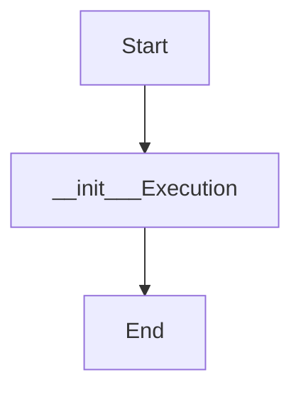

# __init__

Source File: `src/autogen_team/data_access/adapters/__init__.py`

Data Access Adapters.

## Architecture Visualization

```mermaid
flowchart TD
    Start --> __init___Execution
    __init___Execution --> End
```
