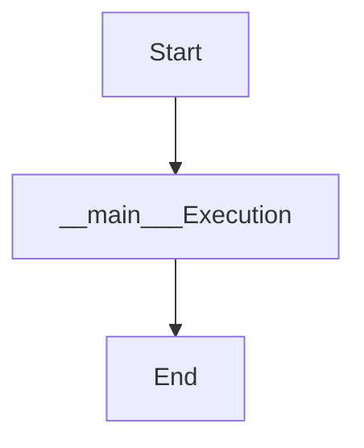

# __main__

Source File: `src/autogen_team/__main__.py`

Entry point of the package.

## Architecture Visualization

```mermaid
flowchart TD
    Start --> __main___Execution
    __main___Execution --> End
```
