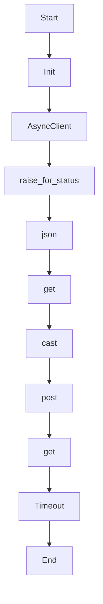

# _query_r2r_security

Source File: `src/autogen_team/application/mcp/tools/security_review.py`

Query R2R RAG for security best practices relevant to the diff.  Args:     diff: Code diff to find context for.     r2r_base_url: R2R API base URL.  Returns:     List of relevant security documents.

## Architecture Visualization

