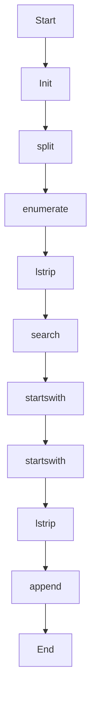

# _scan_owasp_patterns

Source File: `src/autogen_team/application/mcp/tools/security_review.py`

Scan diff against OWASP patterns.  Args:     diff: The code diff string to analyze.  Returns:     List of findings dicts with rule, severity, location, description.

## Architecture Visualization

