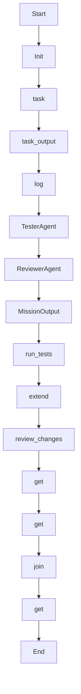

# aggregate_and_review

Source File: `src/autogen_team/application/workflows/autonomous_mission.py`

Step 3: Aggregate child results, run tests, and perform security review.

## Architecture Visualization

