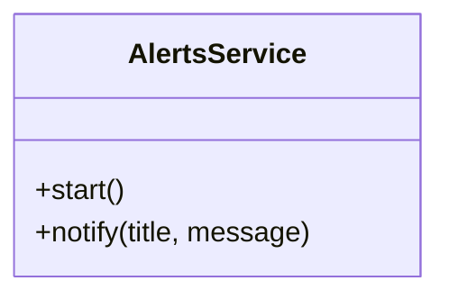

# AlertsService

Source File: `src/autogen_team/infrastructure/services/alert_service.py`

Service for sending notifications.

## Architecture Visualization

```mermaid
classDiagram
    class AlertsService {
        +start()
        +notify(title, message)
    }
```
