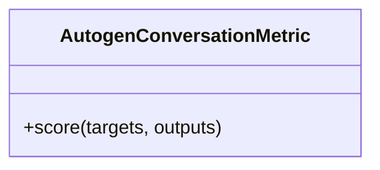

# AutogenConversationMetric

Source File: `src/autogen_team/evaluation/metrics/metrics.py`

Evaluate conversation quality metrics for Autogen interactions.  Parameters:     check_termination (bool): Verify if conversation reached termination     check_error_messages (bool): Check for error messages in output

## Architecture Visualization

