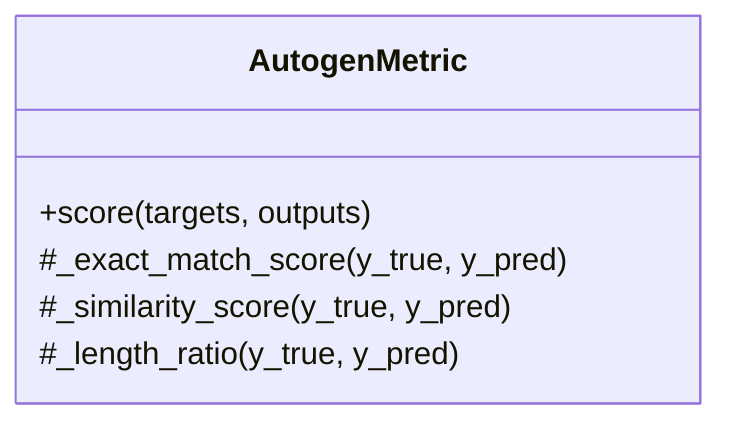

# AutogenMetric

Source File: `src/autogen_team/evaluation/metrics/metrics.py`

Evaluate text-based Autogen responses using conversation metrics.  Parameters:     metric_type (str): Type of text metric (exact_match, similarity, length_ratio)     similarity_threshold (float): Minimum similarity score for partial matches

## Architecture Visualization

