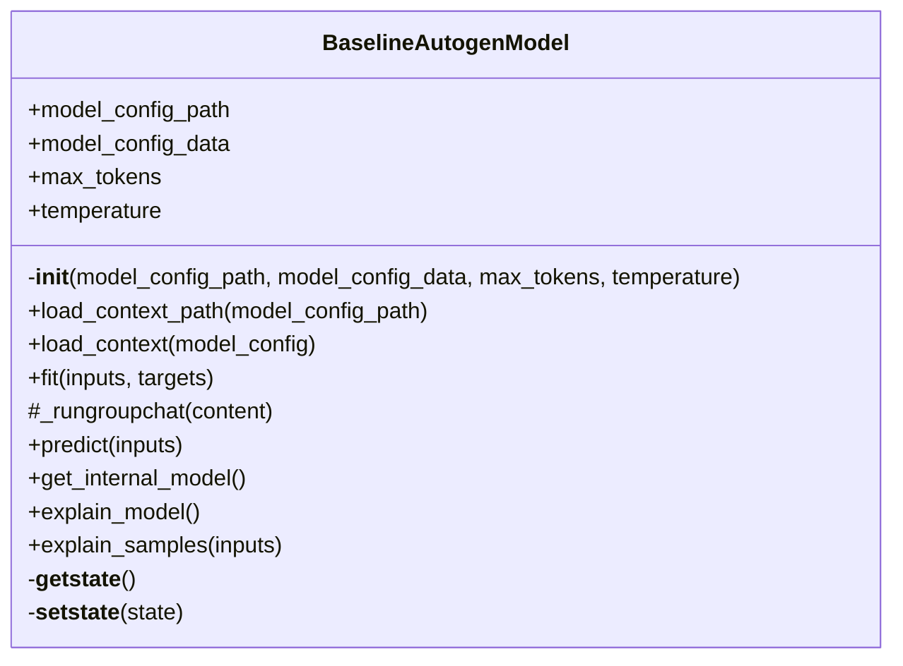

# BaselineAutogenModel

Source File: `src/autogen_team/models/entities.py`

Simple baseline model based on autogen. https://microsoft.github.io/autogen/stable/user-guide/core-user-guide/design-patterns/group-chat.html Parameters:     max_tokens (int): maximum token of the prompt     temperature (float): temperature for the sampling

## Architecture Visualization

