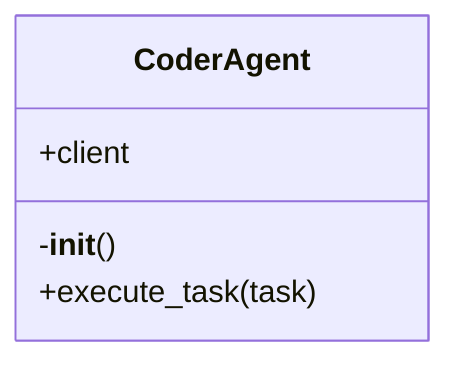

# CoderAgent

Source File: `src/autogen_team/application/agents/coder_agent.py`

Agent responsible for executing coding tasks. Uses the MCP 'execute_code' tool.

## Architecture Visualization

```mermaid
classDiagram
    class CoderAgent {
        +client
        -__init__()
        +execute_task(task)
    }
```
