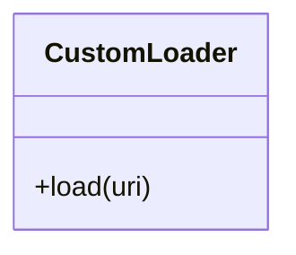

# CustomLoader

Source File: `src/autogen_team/registry/adapters/mlflow_adapter.py`

Loader for custom models using the Mlflow PyFunc module.  https://mlflow.org/docs/latest/python_api/mlflow.pyfunc.html

## Architecture Visualization

