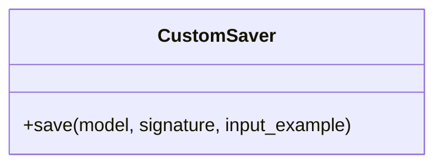

# CustomSaver

Source File: `src/autogen_team/registry/adapters/mlflow_adapter.py`

Saver for project models using the Mlflow PyFunc module.  https://mlflow.org/docs/latest/python_api/mlflow.pyfunc.html https://mlflow.org/blog/autogen-image-agent https://mlflow.org/blog/custom-pyfunc

## Architecture Visualization

