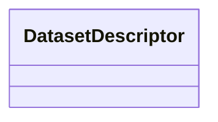

# DatasetDescriptor

Source File: `src/autogen_team/data_access/entities.py`

Describes a dataset source.

## Architecture Visualization

```mermaid
classDiagram
    class DatasetDescriptor {
    }
```
