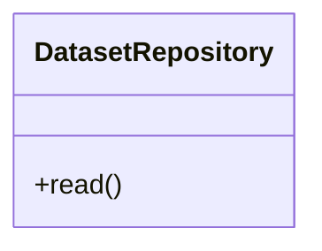

# DatasetRepository

Source File: `src/autogen_team/data_access/repositories.py`

Abstract repository for dataset access.

## Architecture Visualization

```mermaid
classDiagram
    class DatasetRepository {
        +read()
    }
```
