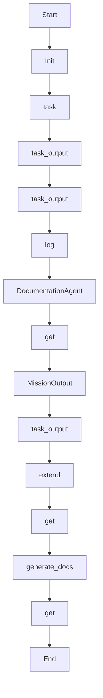

# document_mission

Source File: `src/autogen_team/application/workflows/autonomous_mission.py`

Step 4: Generate documentation and diagrams for the mission.

## Architecture Visualization

```mermaid
flowchart TD
    Start --> Init
    Init --> call_0[task]
    call_0 --> call_1[task_output]
    call_1 --> call_2[task_output]
    call_2 --> call_3[log]
    call_3 --> call_4[DocumentationAgent]
    call_4 --> call_5[get]
    call_5 --> call_6[MissionOutput]
    call_6 --> call_7[task_output]
    call_7 --> call_8[extend]
    call_8 --> call_9[get]
    call_9 --> call_10[generate_docs]
    call_10 --> call_11[get]
    call_11 --> End
```
