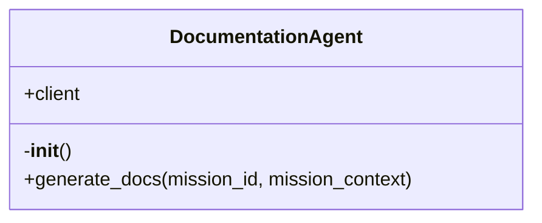

# DocumentationAgent

Source File: `src/autogen_team/application/agents/documentation_agent.py`

Agent responsible for generating mission documentation and diagrams. Uses the MCP 'generate_mission_docs' tool.

## Architecture Visualization

