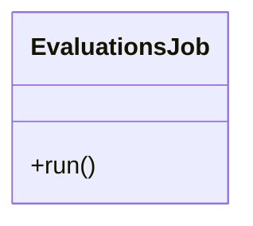

# EvaluationsJob

Source File: `src/autogen_team/application/jobs/evaluations.py`

Generate evaluations from a registered model and a dataset.  Parameters:     run_config (services.MlflowService.RunConfig): mlflow run config.     inputs (datasets.ReaderKind): reader for the inputs data.     targets (datasets.ReaderKind): reader for the targets data.     model_type (str): model type (e.g., "regressor", "classifier").     alias_or_version (str | int): alias or version for the model.     metrics (metrics_.MetricKind): metrics for the reporting.     evaluators (list[str]): list of evaluators to use.     thresholds (dict[str, metrics_.Threshold] | None): metric thresholds.

## Architecture Visualization

