# execute_code

Source File: `src/autogen_team/application/mcp/tools/execute_code.py`

Generate code changes for a task and validate in sandbox.  Args:     task: A task dict (from DAG) with id, name, description.     workspace_path: Path to the workspace root.  Returns:     A dict with files_changed list and status.

## Architecture Visualization

```mermaid
flowchart TD
    Start --> Init
    Init --> call_0[get]
    call_0 --> call_1[get]
    call_1 --> call_2[walk]
    call_2 --> call_3[MCPService]
    call_3 --> call_4[get_prompt]
    call_4 --> call_5[get]
    call_5 --> call_6[mkdtemp]
    call_6 --> call_7[get]
    call_7 --> call_8[join]
    call_8 --> call_9[loads]
    call_9 --> call_10[rmtree]
    call_10 --> call_11[endswith]
    call_11 --> call_12[acompletion]
    call_12 --> call_13[exception]
    call_13 --> call_14[get]
    call_14 --> call_15[get]
    call_15 --> call_16[get]
    call_16 --> call_17[endswith]
    call_17 --> call_18[append]
    call_18 --> call_19[isabs]
    call_19 --> call_20[startswith]
    call_20 --> call_21[safe_join]
    call_21 --> call_22[safe_join]
    call_22 --> call_23[relpath]
    call_23 --> call_24[append]
    call_24 --> call_25[safe_join]
    call_25 --> call_26[makedirs]
    call_26 --> call_27[getcwd]
    call_27 --> call_28[join]
    call_28 --> call_29[append]
    call_29 --> call_30[exists]
    call_30 --> call_31[dirname]
    call_31 --> call_32[open]
    call_32 --> call_33[write]
    call_33 --> call_34[append]
    call_34 --> call_35[compile]
    call_35 --> call_36[remove]
    call_36 --> call_37[replace]
    call_37 --> call_38[append]
    call_38 --> End
```

