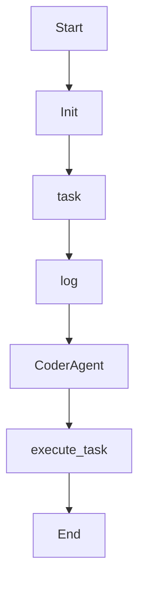

# execute_coding_task

Source File: `src/autogen_team/application/workflows/autonomous_mission.py`

Run the Coder Agent on a single task inside a child workflow.

## Architecture Visualization

```mermaid
flowchart TD
    Start --> Init
    Init --> call_0[task]
    call_0 --> call_1[log]
    call_1 --> call_2[CoderAgent]
    call_2 --> call_3[execute_task]
    call_3 --> End
```
