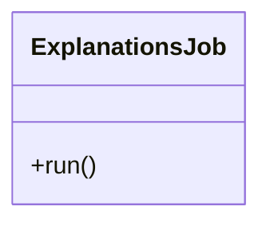

# ExplanationsJob

Source File: `src/autogen_team/application/jobs/explanations.py`

Generate explanations from the model and a data sample.  Parameters:     inputs_samples (datasets.ReaderKind): reader for the samples data.     models_explanations (datasets.WriterKind): writer for models explanation.     samples_explanations (datasets.WriterKind): writer for samples explanation.     alias_or_version (str | int): alias or version for the  model.     loader (registries.LoaderKind): registry loader for the model.

## Architecture Visualization

