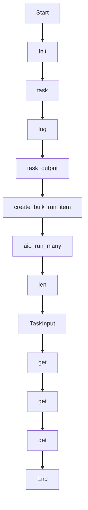

# fan_out_tasks

Source File: `src/autogen_team/application/workflows/autonomous_mission.py`

Step 2: Spawn parallel child workflows for each coding task.  Uses ``develop_task_workflow.aio_run_many`` for true parallel fan-out execution across the Hatchet worker pool.

## Architecture Visualization

