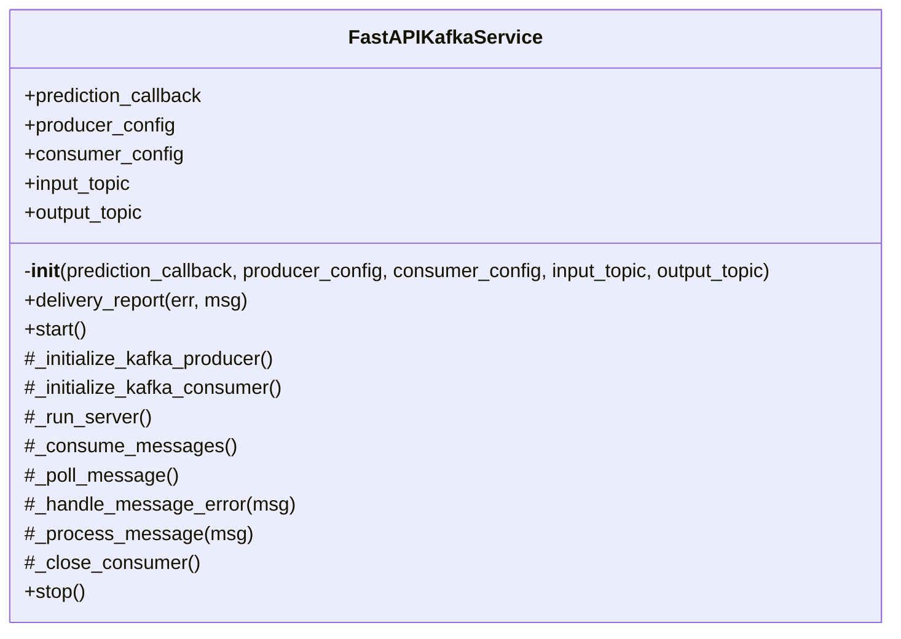

# FastAPIKafkaService

Source File: `src/autogen_team/infrastructure/messaging/kafka_app.py`

Service for deploying a FastAPI application with a Kafka producer and consumer.

## Architecture Visualization

