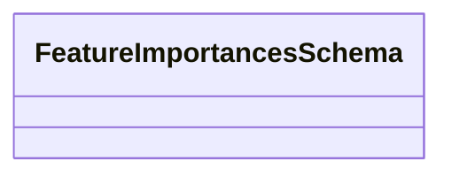

# FeatureImportancesSchema

Source File: `src/autogen_team/core/schemas.py`

Schema for feature importances.

## Architecture Visualization

```mermaid
classDiagram
    class FeatureImportancesSchema {
    }
```
