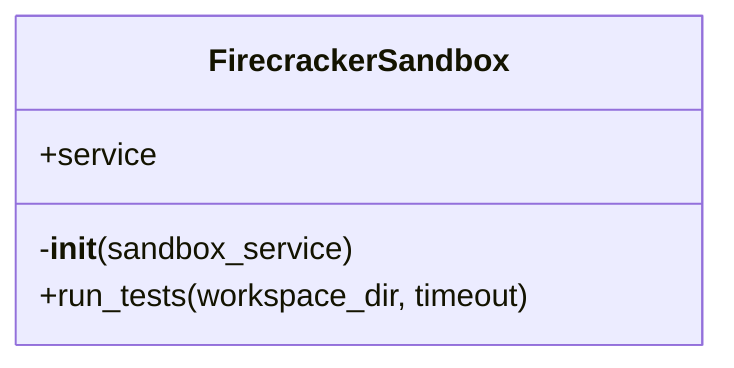

# FirecrackerSandbox

Source File: `src/autogen_team/application/mcp/tools/run_tests.py`

Firecracker-based sandbox using SandboxService.

## Architecture Visualization

```mermaid
classDiagram
    class FirecrackerSandbox {
        +service
        -__init__(sandbox_service)
        +run_tests(workspace_dir, timeout)
    }
```
