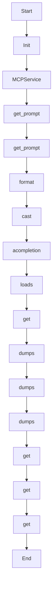

# generate_mission_docs

Source File: `src/autogen_team/application/mcp/tools/generate_mission_docs.py`

Generate Mermaid diagrams and documentation for a mission.  Args:     mission_id: Unique identifier for the mission.     mission_context: Context including goal, tasks, results, and file changes.  Returns:     A dict containing generated Mermaid diagrams and documentation.

## Architecture Visualization

