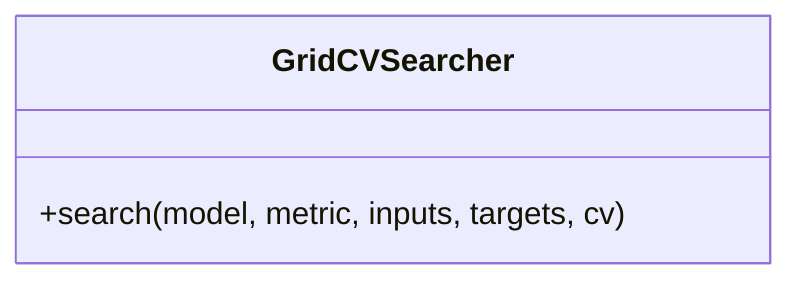

# GridCVSearcher

Source File: `src/autogen_team/infrastructure/utils/searchers.py`

Grid searcher with cross-fold validation.  Convention: metric returns higher values for better models.  Parameters:     n_jobs (int, optional): number of jobs to run in parallel.     refit (bool): refit the model after the tuning.     verbose (int): set the searcher verbosity level.     error_score (str | float): strategy or value on error.     return_train_score (bool): include train scores if True.

## Architecture Visualization

