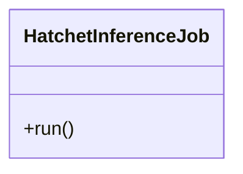

# HatchetInferenceJob

Source File: `src/autogen_team/application/jobs/hatchet_inference.py`

Trigger a Hatchet inference workflow.  This job acts as a client-side proxy that starts the asynchronous inference process in the Hatchet engine.  Parameters:     inputs (datasets.ReaderKind): reader for the inputs data.     outputs (datasets.WriterKind): writer for the outputs data.     alias_or_version (str | int): alias or version for the model.     loader (registries.LoaderKind): registry loader for the model.     hatchet_service (services.HatchetService): manage the Hatchet system.

## Architecture Visualization

