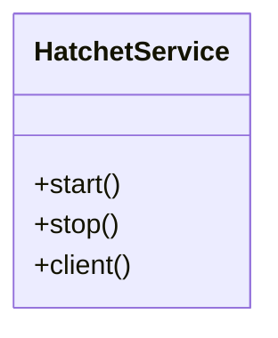

# HatchetService

Source File: `src/autogen_team/infrastructure/services/hatchet_service.py`

Service for Hatchet task orchestration.

## Architecture Visualization

```mermaid
classDiagram
    class HatchetService {
        +start()
        +stop()
        +client()
    }
```
