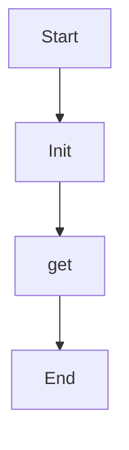

# health_check

Source File: `src/autogen_team/infrastructure/messaging/kafka_app.py`

Simple health check endpoint to verify that the service is running.

## Architecture Visualization

```mermaid
flowchart TD
    Start --> Init
    Init --> call_0[get]
    call_0 --> End
```
