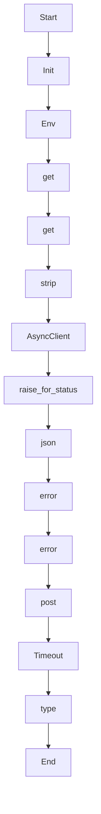

# index_code

Source File: `src/autogen_team/application/mcp/tools/index_code.py`

Index a code file into R2R knowledge graph for future retrieval.  Args:     file_path: Path of the file being indexed.     content: Full content of the file.     metadata: Optional metadata dict (language, author, etc).  Returns:     Dict with document_id and status.

## Architecture Visualization

