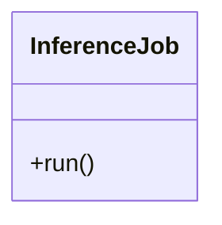

# InferenceJob

Source File: `src/autogen_team/application/jobs/inference.py`

Generate batch predictions from a registered model.  Parameters:     inputs (datasets.ReaderKind): reader for the inputs data.     outputs (datasets.WriterKind): writer for the outputs data.     alias_or_version (str | int): alias or version for the  model.     loader (registries.LoaderKind): registry loader for the model.

## Architecture Visualization

