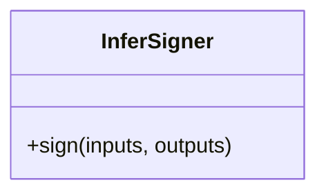

# InferSigner

Source File: `src/autogen_team/infrastructure/utils/signers.py`

Generate model signatures from inputs/outputs data.

## Architecture Visualization

```mermaid
classDiagram
    class InferSigner {
        +sign(inputs, outputs)
    }
```
