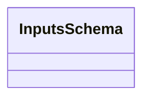

# InputsSchema

Source File: `src/autogen_team/core/schemas.py`

Schema for validating large string inputs.

## Architecture Visualization

```mermaid
classDiagram
    class InputsSchema {
    }
```
