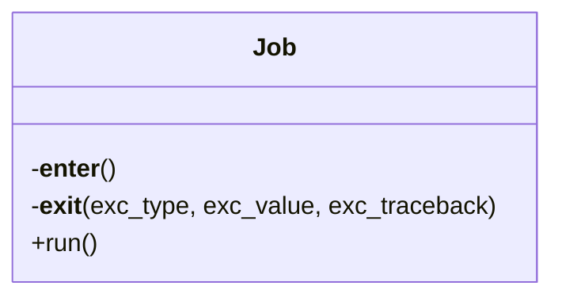

# Job

Source File: `src/autogen_team/application/jobs/base.py`

Base class for a job.  use a job to execute runs in  context. e.g., to define common services like logger  Parameters:     logger_service (services.LoggerService): manage the logger system.     alerts_service (services.AlertsService): manage the alerts system.     mlflow_service (services.MlflowService): manage the mlflow system.

## Architecture Visualization

