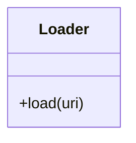

# Loader

Source File: `src/autogen_team/registry/adapters/mlflow_adapter.py`

Base class for loading models from registry.  Separate model definition from deserialization. e.g., to switch between deserialization flavors.

## Architecture Visualization

