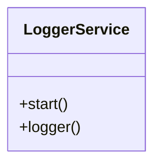

# LoggerService

Source File: `src/autogen_team/infrastructure/services/logger_service.py`

Service for logging messages.  https://loguru.readthedocs.io/en/stable/api/logger.html

## Architecture Visualization

