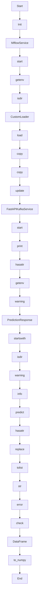

# main

Source File: `src/autogen_team/infrastructure/messaging/kafka_app.py`

Concise functional summary.

## Architecture Visualization

```mermaid
flowchart TD
    Start --> Init
    Init --> call_0[MlflowService]
    call_0 --> call_1[start]
    call_1 --> call_2[getenv]
    call_2 --> call_3[isdir]
    call_3 --> call_4[CustomLoader]
    call_4 --> call_5[load]
    call_5 --> call_6[copy]
    call_6 --> call_7[copy]
    call_7 --> call_8[update]
    call_8 --> call_9[FastAPIKafkaService]
    call_9 --> call_10[start]
    call_10 --> call_11[print]
    call_11 --> call_12[hasattr]
    call_12 --> call_13[getenv]
    call_13 --> call_14[warning]
    call_14 --> call_15[PredictionResponse]
    call_15 --> call_16[startswith]
    call_16 --> call_17[isdir]
    call_17 --> call_18[warning]
    call_18 --> call_19[info]
    call_19 --> call_20[predict]
    call_20 --> call_21[hasattr]
    call_21 --> call_22[replace]
    call_22 --> call_23[tolist]
    call_23 --> call_24[str]
    call_24 --> call_25[error]
    call_25 --> call_26[check]
    call_26 --> call_27[DataFrame]
    call_27 --> call_28[to_numpy]
    call_28 --> End
```
