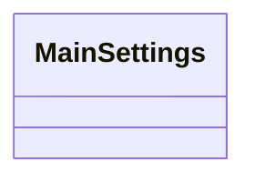

# MainSettings

Source File: `src/autogen_team/settings.py`

Main settings of the application.  Parameters:     job (jobs.JobKind): job to run.

## Architecture Visualization

```mermaid
classDiagram
    class MainSettings {
    }
```
