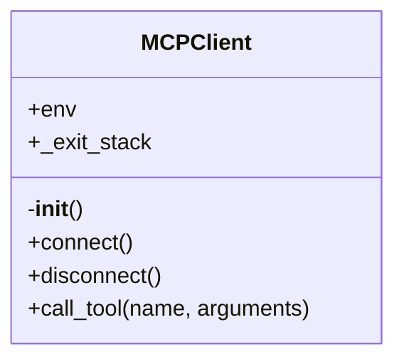

# MCPClient

Source File: `src/autogen_team/infrastructure/client/mcp_client.py`

Client for interacting with the MCP Server.

## Architecture Visualization

```mermaid
classDiagram
    class MCPClient {
        +env
        +_exit_stack
        -__init__()
        +connect()
        +disconnect()
        +call_tool(name, arguments)
    }
```
