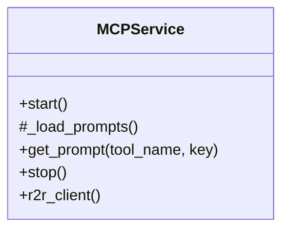

# MCPService

Source File: `src/autogen_team/infrastructure/services/mcp_service.py`

Service for MCP server lifecycle and backend clients.  Manages LiteLLM and R2R HTTP client initialization, providing a single point of access for all MCP tool backends.  Parameters:     litellm_api_base (str): LiteLLM API base URL.     litellm_api_key (str): LiteLLM API key.     litellm_model (str): Default LiteLLM model identifier.     r2r_base_url (str): R2R RAG API base URL.

## Architecture Visualization

