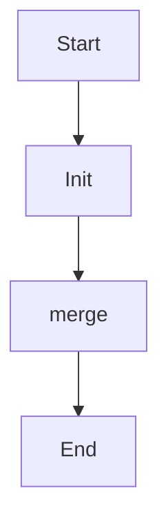

# merge_configs

Source File: `src/autogen_team/infrastructure/io/configs.py`

Merge a list of config into a single config.  Args:     configs (T.Sequence[Config]): list of configs.  Returns:     Config: representation of the merged config objects.

## Architecture Visualization

