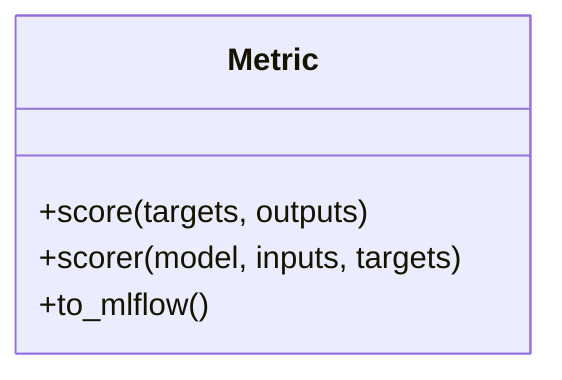

# Metric

Source File: `src/autogen_team/evaluation/metrics/metrics.py`

Base class for a project metric.  Use metrics to evaluate model performance. e.g., accuracy, precision, recall, MAE, F1, ...  Parameters:     name (str): name of the metric for the reporting.     greater_is_better (bool): maximize or minimize result.

## Architecture Visualization

