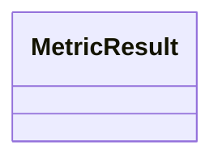

# MetricResult

Source File: `src/autogen_team/evaluation/entities.py`

Represents a metric evaluation result.

## Architecture Visualization

```mermaid
classDiagram
    class MetricResult {
    }
```
