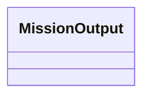

# MissionOutput

Source File: `src/autogen_team/application/workflows/autonomous_mission.py`

Final output of the autonomous-mission workflow.

## Architecture Visualization

```mermaid
classDiagram
    class MissionOutput {
    }
```
