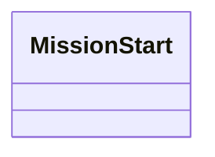

# MissionStart

Source File: `src/autogen_team/infrastructure/messaging/a2a_protocol.py`

Event payload to start a new autonomous mission.

## Architecture Visualization

```mermaid
classDiagram
    class MissionStart {
    }
```
