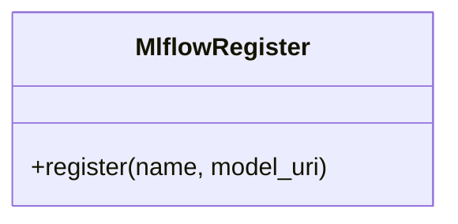

# MlflowRegister

Source File: `src/autogen_team/registry/adapters/mlflow_adapter.py`

Register for models in the Mlflow Model Registry.  https://mlflow.org/docs/latest/model-registry.html

## Architecture Visualization

