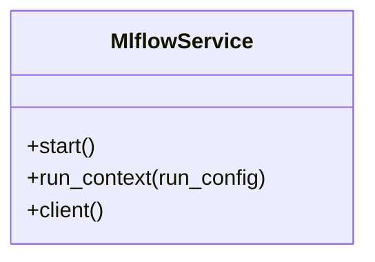

# MlflowService

Source File: `src/autogen_team/infrastructure/services/mlflow_service.py`

Service for Mlflow tracking and registry.

## Architecture Visualization

```mermaid
classDiagram
    class MlflowService {
        +start()
        +run_context(run_config)
        +client()
    }
```
