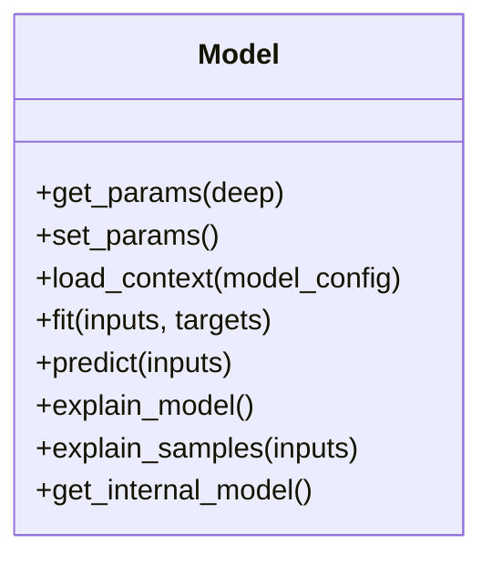

# Model

Source File: `src/autogen_team/models/entities.py`

Base class for a project model.  Use a model to adapt AI/ML frameworks. e.g., to swap easily one model with another.

## Architecture Visualization

