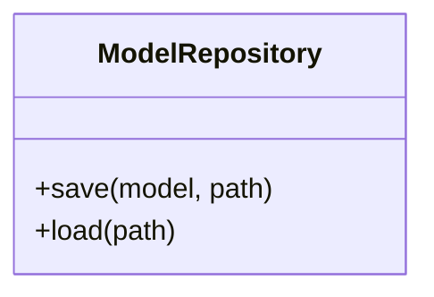

# ModelRepository

Source File: `src/autogen_team/models/repositories.py`

Abstract repository for model persistence.

## Architecture Visualization

```mermaid
classDiagram
    class ModelRepository {
        +save(model, path)
        +load(path)
    }
```
