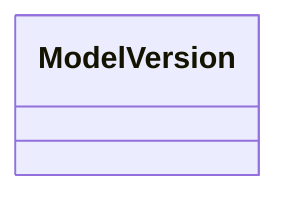

# ModelVersion

Source File: `src/autogen_team/registry/entities.py`

Represents a registered model version.

## Architecture Visualization

```mermaid
classDiagram
    class ModelVersion {
    }
```
